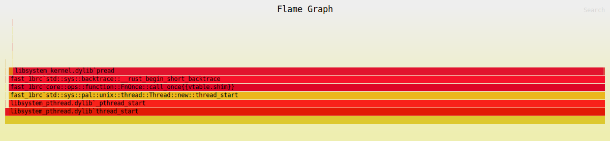

# Fast 1BRC

## Overview

This is my solution to [The One Billion Row Challenge](https://github.com/gunnarmorling/1brc) which consists of processing a file with one billion rows.
Each row consists of a weather station name and a temperature reading. The goal is to compute the minimum, mean, and maximum temperatures for each weather station and output the results in an alphabetically ordered format.

## Performance

| **Platform**                        | **User Time** | **System Time** | **CPU Usage** | **Total Time** |
| ----------------------------------- | ------------- | --------------- | ------------- | -------------- |
| MacBook PRO, M1 Pro 2021, 32 GB RAM | 0.07s         | 3.49s           | 308%          | 1.155s         |
| MacBook PRO, M1 Pro 2020, 16 GB RAM | 0.04s         | 3.20s           | 39%           | 8.187s         |

## Flamegraph



## Getting Started

### 1. Generate the Dataset

To create the required dataset for the challenge, execute the following command:

```bash
cargo run --release --package generate-dataset 1000000000
```

- **Description:** Compiles and runs the `generate-dataset` package in release mode, generating a `measurements.txt` file containing **1,000,000,000** temperature records.
- **Output Format:**
  ```
  Hamburg;12.0
  Bulawayo;8.9
  Palembang;38.8
  Hamburg;34.2
  St. John's;15.2
  Cracow;12.6
  ... etc. ...
  ```

### 2. Run the Processor

After generating the dataset, build and execute the temperature processor using the following command:

```bash
cargo build --release && time target/release/fast_1brc
```

## Technical Implementation

### 1. Chunk-Based File Reading

- **Chunk Size:** The input file `measurements.txt` is partitioned into **16 MB** chunks (`CHUNK_SIZE = 16 * 1024 * 1024`).
- **Chunk Overlap:** To handle lines that span across chunks, each chunk includes an overlap of **64 bytes** (`CHUNK_OVERLAP = 64`).
- **File Access:** Utilizes `FileExt::read_at` for concurrent, thread-safe reads of specific file segments, enabling parallel processing without seeking conflicts.

### 2. Parallel Processing with Crossbeam

- **Thread Management:** Employs the `crossbeam` crate to create scoped threads, dynamically matching the number of available CPU cores (`num_cpus::get()`).
- **Work Distribution:** An `AtomicU64` (`offset`) manages the distribution of file read offsets, ensuring each thread processes a unique file segment without overlap, except for the intentional `CHUNK_OVERLAP`.

### 3. SIMD Optimization for Newline Detection

- **SIMD Utilization:** Implements Rust's SIMD capabilities via the `std::simd` module to accelerate the detection of newline characters (`\n`).
- **Functionality:** The `find_next_newline_simd` function processes the buffer in 64-byte SIMD vectors, performing parallel comparisons to locate newline characters efficiently. If no newline is found within the SIMD-processed block, it falls back to scalar byte-by-byte scanning for the remaining data.

  ```rust
  fn find_next_newline_simd(buffer: &[u8]) -> Option<usize> {
      let mut index = 0;
      let simd_size = 64;

      while index + simd_size <= buffer.len() {
          let bytes = Simd::<u8, 64>::from_slice(&buffer[index..index + simd_size]);
          let mask = bytes.simd_eq(Simd::splat(b'\n'));
          let bits = mask.to_bitmask();

          if bits != 0 {
              let pos = bits.trailing_zeros() as usize;
              return Some(index + pos);
          }

          index += simd_size;
      }

      for i in index..buffer.len() {
          if buffer[i] == b'\n' {
              return Some(i);
          }
      }

      None
  }
  ```

### 4. Parsing and Aggregation

- **Temperature Parsing:** Utilizes the `fast_float` crate to convert temperature byte slices to `f64` values rapidly through the `parse_temp` function.

  ```rust
  fn parse_temp(bytes: &[u8]) -> Option<f64> {
      fast_parse_float(bytes).ok()
  }
  ```

- **Chunk Processing:** The `process_chunk` function iterates through each line within a chunk, parsing the station name and temperature, and aggregates the data using a local `FxHashMap`.

  ```rust
  fn process_chunk<'a>(chunk: &'a [u8]) -> fxhash::FxHashMap<&'a [u8], Records> {
      let mut map: fxhash::FxHashMap<&'a [u8], Records> = fxhash::FxHashMap::default();

      let mut start = 0;
      let len = chunk.len();

      while start < len {
          let end = match find_next_newline_simd(&chunk[start..]) {
              Some(pos) => start + pos,
              None => len,
          };

          let line = &chunk[start..end];
          if let Some(pos) = memchr::memchr(b';', line) {
              let station = &line[..pos];
              let temp_bytes = &line[pos + 1..];

              if let Some(temp) = parse_temp(temp_bytes) {
                  map.entry(station)
                      .and_modify(|e| e.update(temp))
                      .or_insert_with(|| Records::new(temp));
              }
          }

          start = end + 1;
      }

      map
  }
  ```

### 5. Concurrent Data Aggregation

- **Global Aggregation Map:** An `Arc<Mutex<HashMap<String, Records, FxBuildHasher>>>` serves as the thread-safe global hash map for aggregating results from all threads.

  ```rust
  let global_map = Arc::new(Mutex::new(HashMap::with_hasher(FxBuildHasher::default())));
  ```

- **Merging Local Maps:** Each thread maintains a local `FxHashMap` during chunk processing. After processing, the local map is merged into the global map within a mutex-protected block to ensure thread safety.

  ```rust
  let mut global_map = global_map.lock().unwrap();
  for (station_bytes, records) in local_map {
      let station = String::from_utf8_lossy(station_bytes).to_string();
      global_map
          .entry(station)
          .and_modify(|e: &mut Records| e.merge(&records))
          .or_insert(records);
  }
  ```

### 6. Memory Allocation with Jemalloc

- **Allocator Configuration:** Integrates `tikv_jemallocator` as the global memory allocator to optimize allocation patterns, particularly beneficial for the high-throughput, multi-threaded nature of the application.

  ```rust
  #[cfg(not(target_env = "msvc"))]
  use tikv_jemallocator::Jemalloc;

  #[cfg(not(target_env = "msvc"))]
  #[global_allocator]
  static GLOBAL: Jemalloc = Jemalloc;
  ```

### 7. Processing Workflow

1. **File Initialization:** Opens `measurements.txt` and retrieves its size to determine the total number of chunks.
2. **Thread Spawning:** Creates threads equal to the number of CPU cores available.
3. **Chunk Reading:** Each thread reads assigned chunks with overlap handling to ensure complete line reads.
4. **Line Parsing:** Utilizes SIMD-optimized newline detection to identify and parse each line within the chunk.
5. **Data Aggregation:** Updates local `FxHashMap` instances with temperature statistics for each station.
6. **Global Aggregation:** Merges local maps into the global hash map under mutex protection.
7. **Result Compilation:** After all chunks are processed, the program sorts station names alphabetically and outputs the aggregated statistics.
