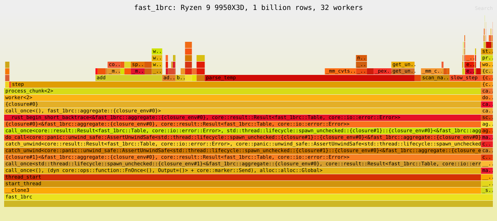

# Fast 1BRC

A Rust implementation of the [One Billion Row Challenge](https://github.com/gunnarmorling/1brc), processing **one billion rows in 0.2335 seconds** with no external libraries. The solver follows the challenge's input and output rules, lives in one source file, and runs on 64-bit Linux and macOS.

## Run

```sh
cargo build --release --workspace
./target/release/generate-dataset 1000000000 measurements.txt 42
./target/release/fast_1brc measurements.txt
```

Skip generation if you already have a dataset. One billion rows need about 14 GB of disk space.

## Performance

The **0.2335 s** result is **27.7% below the published 0.323 s Java bonus winner**. The implementations below were measured on different hardware and inputs.

| Implementation | Time | Hardware |
| --- | ---: | --- |
| **fast_1brc (Rust)** | **0.2335 s** | Ryzen 9 9950X3D, 16 cores / 32 threads |
| [jerrinot (Java)](https://www.morling.dev/blog/1brc-results-are-in/#_bonus_result_32_cores_64_threads) | 0.323 s | EPYC 7502P, 32 cores / 64 threads |
| [thomaswue (Java)](https://www.morling.dev/blog/1brc-results-are-in/#_bonus_result_32_cores_64_threads) | 0.326 s | EPYC 7502P, 32 cores / 64 threads |
| [arthurlm (Rust)](https://github.com/arthurlm/one-brc-rs#my-implementation-results) | 0.810 s | Ryzen 9 7950X, 16 cores / 32 threads, WSL2 |
| [Ragnar Groot Koerkamp (Rust)](https://curiouscoding.nl/posts/1brc/) | 0.900 s | i7-10750H, 6 cores, 4.6 GHz |

The fast_1brc result uses 32 workers, 64 GB DDR5-6000, and a warm file cache, built with Rust 1.98.1 and native CPU optimizations. It is the mean of nine runs after discarding the fastest and slowest, including startup, output, and process cleanup.

## Implementation

Every row needs a station lookup before its temperature can update a total. On x86-64, a 16-byte scan finds the semicolon and CRC32 chooses a table slot. The primary table keeps the first 16 name bytes beside the statistics, so short names can be checked without following a pointer to another string. Longer names and collisions still get full comparisons.

Temperatures have only four layouts: `d.d`, `dd.d`, `-d.d`, and `-dd.d`. AVX2 converts two temperatures at once while checking every digit. Prefetching the station slots before this arithmetic gives their cache lines time to arrive. SSSE3 and BMI2 handle unpaired rows. Values stay in integer tenths, and SSE4.1 updates packed statistics with 64-bit sums. CPUs without these instructions use scalar fallbacks. The paired parser and prefetching adapt ideas from [Noah Falk’s implementation](https://github.com/noahfalk/1brc).

On Linux, each worker maps 16 MiB at a time, processes it in 1 MiB chunks, and releases the mapping before claiming another window. Each chunk has two interleaved input streams for the paired parser. Workers own their station tables, keeping locks out of per-row updates. The tables are merged once before sorting and formatting the result.

[](flamegraph.svg)
